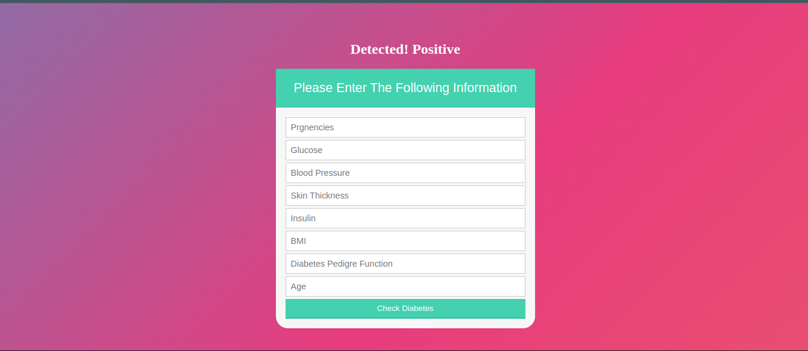

<a name="readme-top"></a>

<div align="center">
  <br/>

  <h3><b>Welcome to To Diabetes Prediction System</b></h3>

</div>

<!-- TABLE OF CONTENTS -->

# 📗 Table of Contents

- [📖 About the Project](#about-project)
  - [🚀 Live Demo](#live-demo)
- [💻 Getting Started](#getting-started)
  - [Setup](#setup)
  - [Prerequisites](#prerequisites)
  - [Usage](#usage)
- [Key Features](#key-features)
- [👥 Authors](#authors)
- [🤝 Contributing](#contributing)
- [⭐️ Show your support](#support)
- [🙏 Acknowledgements](#acknowledgements)
- [📝 License](#license)

<!-- PROJECT DESCRIPTION -->

# 📖 Diabetes Predition System <a name="about-project"></a>

**Diabetes Prediction System** is  a Web Application to Predict Diabetes Disease: An Approach Using Machine Learning Algorithm, main aim of this exploration is to build a web application based on the higher prediction accuracy of some powerful machine learning algorithm. We have used a benchmark dataset namely Pima Indian which is capable of predicting the onset of diabetes based on diagnostics manner. With an accuracy of 70% prediction rate Artificial Neural Network (ANN) shows a significant improvement of accuracy which drives us to develop an Interactive Web Application for Diabetes Prediction.



### Tech Stack <a name="tech-stack"></a>

> Python, Django

<details>
  <summary>Client</summary>
  <ul>
    <li><a href="#">Html</a></li>
        <li><a href="#">Css</a></li>
        <li><a href="#">Python</a></li>
        <li><a href="#">Django</a></li>
  </ul>
</details>

<!-- LIVE DEMO -->

## 🚀 Live Demo <a name="live-demo"></a>

<a href="">Soon</a>

<p align="right">(<a href="#readme-top">back to top</a>)</p>

<!-- GETTING STARTED -->

## 💻 Getting Started <a name="getting-started"></a>


To get a local copy up and running, follow these steps.

### Prerequisites

In order to run this project you need:
* You need to have Python3 installed.

Import the following libraries:
* import pandas as pd
* import matplotlib.pyplot as plt
* import seaborn as sns
* from sklearn.model_selection import train_test_split
* from sklearn.linear_model import LogisticRegression
* from sklearn.metrics import accuracy_score

### Setup

Clone this repository to your desired folder:

```bash
git clone https://github.com/tawakuliKH/Diabetes-Prediction-Django-Web-App.git
```
2. Open terminal and cd into project
```bash
cd DiabetesPrediction
```
3. Run the project with:
```bash
 python3 manage.py runserver
```


### Key Features <a name="key-features"></a>

- **Diabete Disease Detection**
- **High Accuracy**
- **Nice UI**


<p align="right">(<a href="#readme-top">back to top</a>)</p>


## 👥 Authors <a name="authors"></a>

>

👤 **Morteza Tawakuli**

- GitHub: [@tawakuliKH](https://github.com/tawakuliKH)
- LinkedIn: [@Morteza Tawakuli](https://www.linkedin.com/in/morteza-tawakuli-904818170/)


<p align="right">(<a href="#readme-top">back to top</a>)</p>

## 🤝 Contributing

 Contributions, issues, and feature requests are welcome!
- Feel free to check the [issues page](https://github.com/tawakuliKH/Diabetes-Prediction-Django-Web-App/issues)

## ⭐️ Show your support <a name="support"></a>

> 

If you like this project give it a star

<p align="right">(<a href="#readme-top">back to top</a>)</p>

<!-- ACKNOWLEDGEMENTS -->

## 🙏 Acknowledgments <a name="acknowledgements"></a>

### Paper Citation

This project is implemented based on the following paper:

- Author(s): Samrat Kumar Dey, Ashraf Hossain, Md. Mahbubur Rahman
- Title: Implementation of a Web Application to Predict Diabetes Disease: An Approach Using Machine Learning Algorithm
- Published in: [IEEE](https://ieeexplore.ieee.org/document/8631968)


I would like to express our gratitude to the creators of the datasets used in this project:

- [Pima Indian Dataset](https://www.kaggle.com/datasets/uciml/pima-indians-diabetes-database).

<p align="right">(<a href="#readme-top">back to top</a>)</p>
<!-- LICENSE -->

## 📝 License <a name="license"></a>

This project is [MIT](./LICENSE) licensed.

<p align="right">(<a href="#readme-top">back to top</a>)</p>

